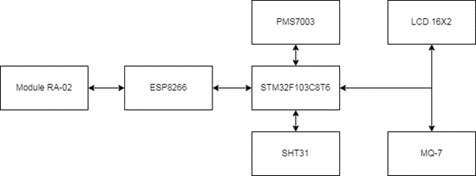
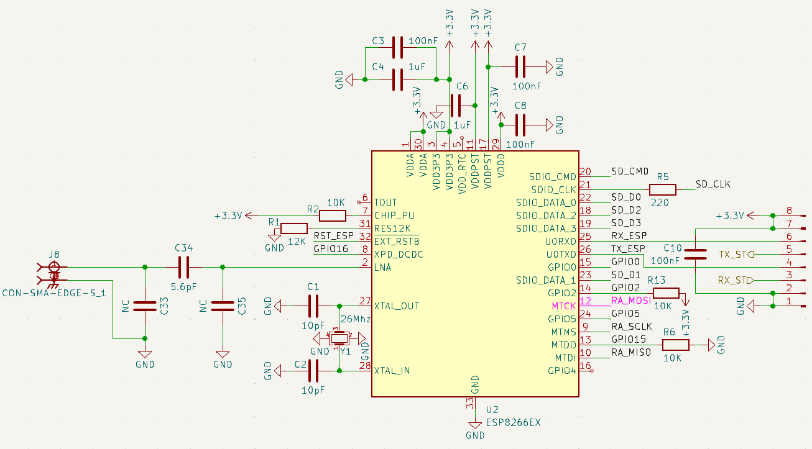
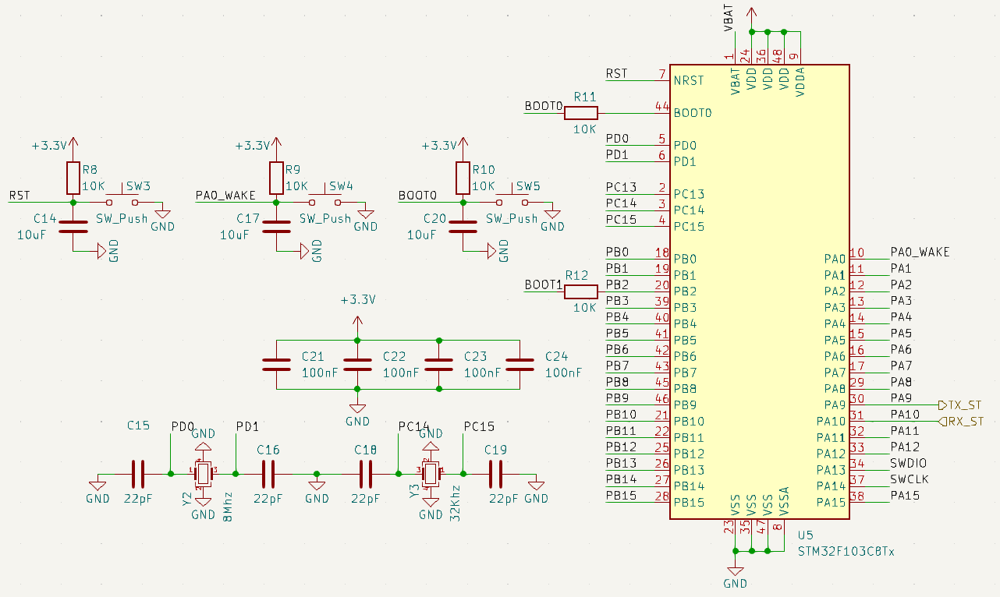
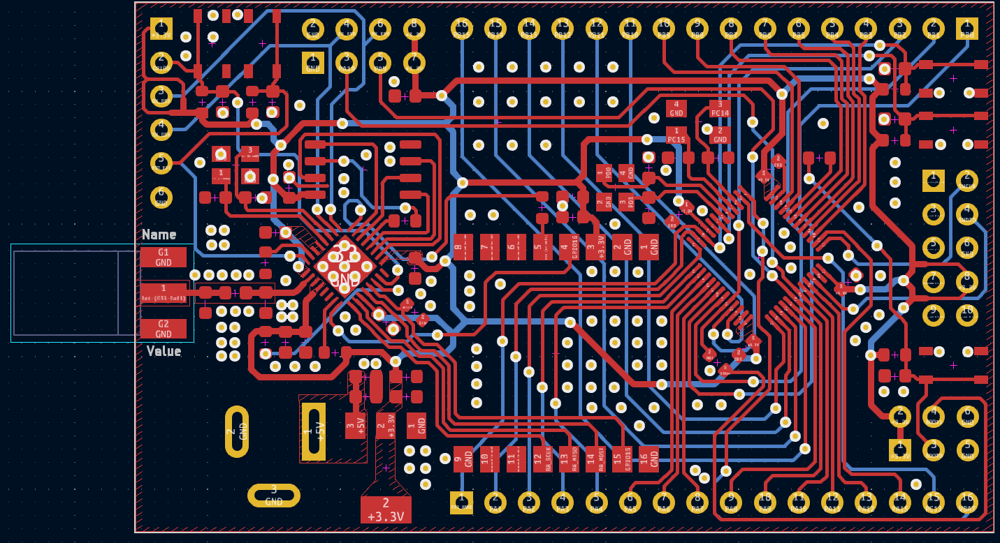

# Kit_DaNang
## Sơ đồ khối

* ESP8266 vs LORA (SPI)
    * GPIO 15 -- NSS
    * GPIO 16 -- RESET
    * GPIO 14 -- CLK
    * GPIO 12 -- MISO 
    * GPIO 13 -- MOSI
    * GPIO 5  -- DIO0
* ESP8266 vs STM32F103C8T6
    * TX -- PA10
    * RX -- PA9
## ESP8266

## STM32F103C8T6

## PCB layout
